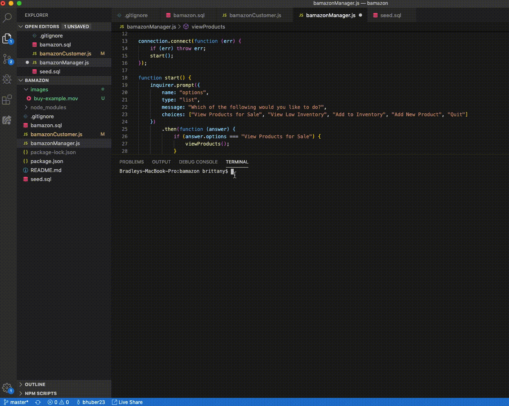
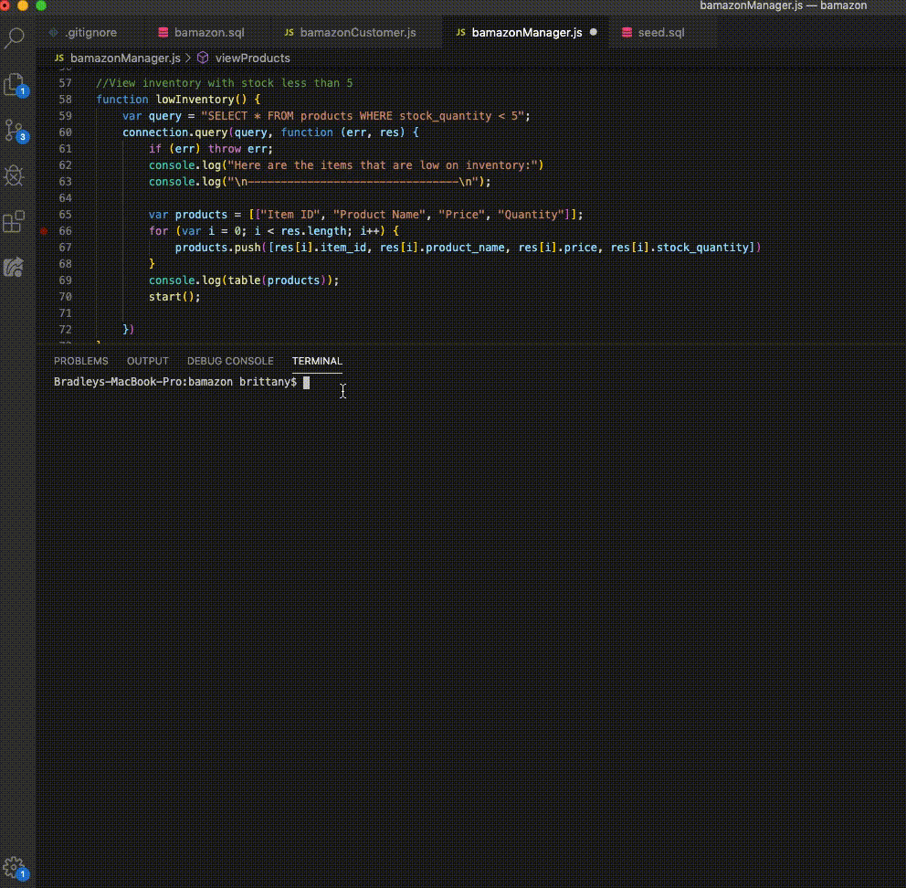
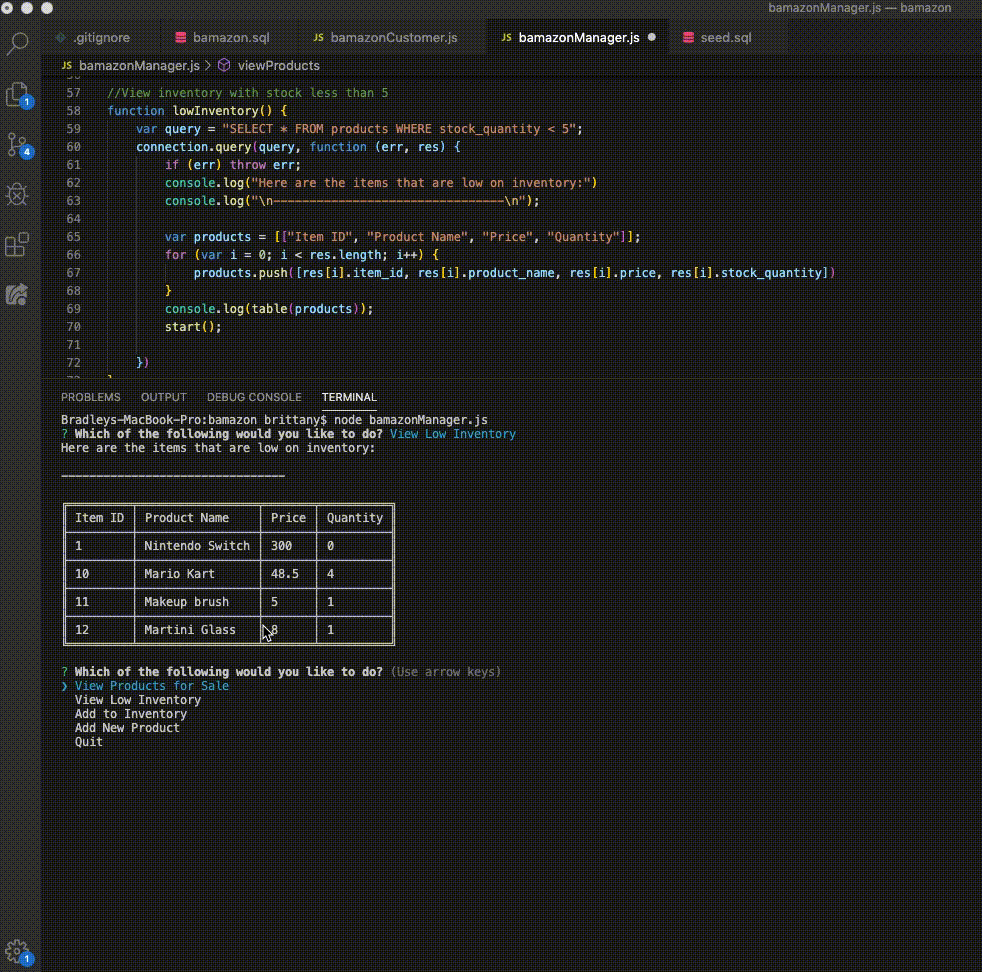

# bamazon
The "bamazon" app is a console-based Node app using MySQL, which creates a store-like environment similar to Amazon. The customer facing app will allow customers to view a list of items available to purchase, allow them to choose the item they which to buy along with the quantity. After they choose, they will get their order total and can then shop again. If they choose a quantity that the store cannot fulfill, they will receive a message notifying them of that and will automatically prompt them to modify their order.

There is a manager facing app, as well, which allows the manager to view the total list of inventory, to view the items with low inventory, to replenish stock, and to add new items to the list. 

## How to Use
The bamazon customer app starts by using the command "node bamazonCustomer.js." The customer automatically receives a table of the inventory that's available (stored in a MySQL database) and then asks them which item they would like to buy using Inquirer. They can select their item from the list and are then asked how many they'd like to purchase. 

After entering their number, they will either receive their order total and be asked if they want to shop again or if they choose a quantity that is too high that the store cannot fulfill, they will be asked to select again to modify their choice.

The bamazon Manager app is ran using "node bamazonManager.js." Using Inquirer, the manager has the options to either View Products For Sale, View Low Inventory (items that have less than 5 in stock), Add to Inventory, or Add New Product. Viewing products for sale will produce a table of all items in stock, along with the department, the price,and the quantity.

Low inventory will display a table of items in which there are less than 5 in stock.

If the manager wants to replenish stock quantities, they would choose Add to Inventory and are then given a list of the items, along with their quantities, and can choose which item from the list they want to replenish. They are then asked how many they will be adding. 

The Add New Product feature allows managers the option to add new items to the store. They will be asked for the name of the product, the department, the price, and how many they are adding. After they have added that, the table updates to show the store's updated list of inventory.

A full video of the entire app demonstration can be found in the images file within the repo.

## Technologies/NPMS Used
- Node.js
- Javascript
- MySQL
- Table NPM
- Inquirer

